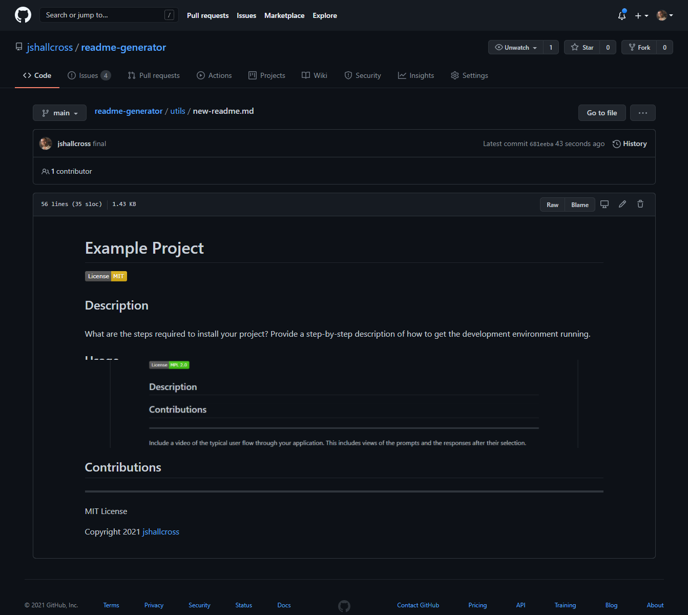

# ReadMe Generator
# University of Toronto Coding BootCamp Challenge Week 9

## Grading Requirements
--- 
Below is the link to the video of the working application.   

You Tube link: (https://youtu.be/3f2y8TK8Vlo)   

Below is the screenshot of the Read Me from the video.  

## Description
---
User input automatically generates a ReadMe file.

## Installation
---
Install Node. Run by typing node index.js in terminal.

## Usage
---  
Easily create professional ReadMe files.

## Screenshot
---  

Example of a user generated ReadMe file.

## Deployed 
---  
https://github.com/jshallcross/readme-generator

## Questions
---   
Any questions can be directed to jshallcross1@icloud.com

## GitHub
---   
GitHub: [jshallcross](https://github.com/jshallcross)

